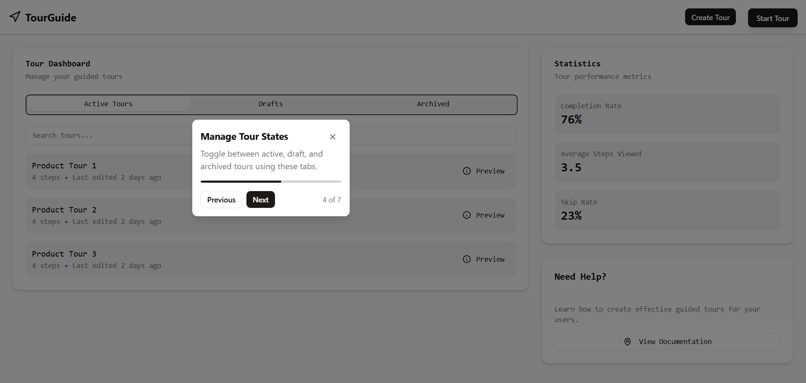

Here's the fixed version with proper formatting and structure:

# Build Your Own React Tour Guide Component

This project demonstrates how to build a custom, lightweight in-app tour guide component using React, TypeScript, and Tailwind CSS. It provides a flexible alternative to existing libraries like React Joyride, allowing for full customization of the user onboarding experience.



## Features

- **Step-by-Step Guidance:** Define a series of steps to guide users through your application's UI.
- **Spotlight Effect:** Highlights the target UI element for each step using a customizable overlay.
- **Dynamic Tooltip Positioning:** Tooltips automatically position themselves relative to the target element (top, bottom, left, right) and stay within the viewport.
- **Smooth Transitions:** CSS animations provide a fluid experience when navigating between steps.
- **Progress Indicator:** Shows users their progress through the tour.
- **Responsive Design:** Adapts to different screen sizes.
- **Customizable:** Easily style the components using Tailwind CSS or standard CSS.
- **Lightweight:** Minimal dependencies compared to larger tour libraries.

## Tech Stack

- **React:** For building the user interface components.
- **TypeScript:** For static typing and improved developer experience.
- **Vite:** As the build tool and development server.
- **Tailwind CSS:** For utility-first styling.
- **Radix UI (`Portal`):** For reliably rendering the tour overlay and tooltip outside the main DOM hierarchy.
- **clsx / cn:** Utility for conditionally joining class names.

## Project Structure

```
/src
|-- components
|   |-- AppLayout.tsx       # Example layout component
|   |-- TourGuide.tsx       # The core tour guide component
|   `-- ui                  # UI primitives (Button, Progress - likely from shadcn/ui)
|-- lib
|   `-- utils.ts            # Utility functions (e.g., cn)
|-- pages
|   `-- index.tsx           # Example page demonstrating the TourGuide usage
`-- main.tsx                # Application entry point
```

## Installation

1. **Clone the repository:**

   ```bash
   git clone https://github.com/codewithjohnson/build-your-own-tour-guide.git
   cd build-your-own-tour-guide
   ```

2. **Install dependencies:**
   ```bash
   npm install
   # or
   yarn install
   # or
   pnpm install
   ```

## Running the Development Server

```bash
npm run dev
# or
yarn dev
# or
pnpm dev
```

Open [http://localhost:5173](http://localhost:5173) (or the port specified by Vite) in your browser to see the example implementation.

## Usage

1. **Import `TourGuide` and `TourStep`:**

   ```typescript
   import { TourGuide, TourStep } from "@/components/TourGuide";
   import { useState } from "react";
   ```

2. **Define your tour steps:**
   Each step requires a `target` (CSS selector for the element to highlight), `title`, and `content`. You can optionally specify the tooltip `position`.

   ```typescript
   const tourSteps: TourStep[] = [
     {
       target: "#header", // CSS Selector for the target element
       title: "Welcome!",
       content: "This is the main header of the application.",
       position: "bottom", // Optional: top, bottom, left, right (default: bottom)
     },
     {
       target: "#sidebar-nav",
       title: "Navigation Menu",
       content: "Use this menu to navigate between different sections.",
       position: "right",
     },
     // ... more steps
   ];
   ```

3. **Control the tour's visibility:**
   Use state to manage whether the tour is open or closed.

   ```typescript
   const [isTourOpen, setIsTourOpen] = useState(false);

   const startTour = () => setIsTourOpen(true);
   const closeTour = () => setIsTourOpen(false);
   ```

4. **Render the `TourGuide` component:**
   Pass the steps array and state management functions as props.

   ```tsx
   return (
     <div>
       {/* Your application layout */}
       <button onClick={startTour}>Start Tour</button>

       {/* Render the TourGuide component */}
       <TourGuide
         steps={tourSteps}
         isOpen={isTourOpen}
         onClose={closeTour} // Called when the close button or overlay is clicked
         onFinish={closeTour} // Called when the user clicks "Finish" on the last step
       />
     </div>
   );
   ```

## Customization

- **Styling:** Modify the Tailwind CSS classes directly within `TourGuide.tsx` or override styles using standard CSS. Adjust colors, padding, fonts, border radius, etc.
- **Animation:** Customize the `animate-fade-in` and `animate-fade-out` classes (defined via Tailwind config or global CSS) for different transition effects.
- **Tooltip Width:** Change the fixed `tooltipWidth` variable in `TourGuide.tsx` if needed.

## Contributing

Contributions are welcome! Please feel free to submit issues or pull requests.

1. Fork the repository.
2. Create a new branch (`git checkout -b feature/your-feature-name`).
3. Make your changes.
4. Commit your changes (`git commit -m 'Add some feature'`).
5. Push to the branch (`git push origin feature/your-feature-name`).
6. Open a Pull Request.

## License

This project is open-source and available under the [MIT License](LICENSE). <!-- Add a LICENSE file if you want -->
